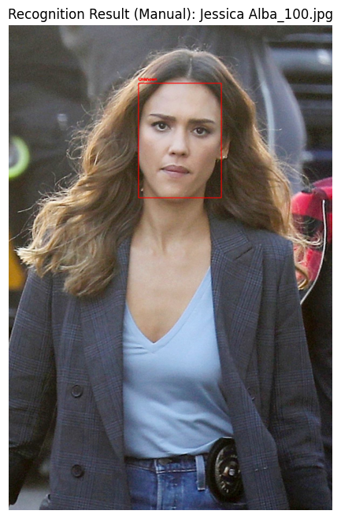

# Face Detection and Recognition System Project

## Introduction and Purpose

The purpose of this project is to automatically detect human faces in a given image and identify them by comparing the detected faces with a pre-defined gallery of individuals. The system should also be able to label unrecognized faces as "Unknown."

## Dataset and Gallery

* **Data Source:** The [`vasukipatel/face-recognition-dataset`](https://www.kaggle.com/datasets/vasukipatel/face-recognition-dataset) from Kaggle was used for face images. This dataset includes facial photographs of various celebrities.
* **Gallery Creation:** The gallery of "known individuals" to be recognized was created by selecting a specific subset (e.g., the first 5 or 10 celebrities) from the celebrity subfolders located under the `Original Images/Original Images/` directory in this dataset. Photos in each celebrity's folder were used as reference images for that person.
* **Test Images:** Various test images of both celebrities included and not included in the gallery were used to test the system's performance. Some processed examples include:

  1- `"/kaggle/input/face-recognition-dataset/Original Images/Original Images/Jessica Alba/Jessica Alba_100.jpg"`

  2- `"/kaggle/input/face-recognition-dataset/Original Images/Original Images/Akshay Kumar/Akshay Kumar_1.jpg"`

  3- `"/kaggle/input/face-recognition-dataset/Original Images/Original Images/Alexandra Daddario/Alexandra Daddario_15.jpg"`

  4- `"/kaggle/input/face-recognition-dataset/Original Images/Original Images/Natalie Portman/Natalie Portman_11.jpg"`

  5- `"/kaggle/input/face-recognition-dataset/Original Images/Original Images/Alia Bhatt/Alia Bhatt_23.jpg"`

  6- `"/kaggle/input/face-recognition-dataset/Original Images/Original Images/Amitabh Bachchan/Amitabh Bachchan_19.jpg"`

  7- `"/kaggle/input/face-recognition-dataset/Original Images/Original Images/Andy Samberg/Andy Samberg_17.jpg"`

* Inference is made from the trained model for the first 5 people in the dataset. The people outside the first 5 are 1 and 4. Expectation: 1 and 4 will be predicted as "Unknown" and the others will be predicted correctly.
  
## Methodology

The project followed a workflow that includes the following steps and libraries:

1. **Face Detection:** The `mtcnn` library was used to determine the locations of faces in input images. MTCNN (Multi-task Cascaded Convolutional Networks) is a deep learning model that can detect faces and important facial points (landmarks) with high accuracy. Bounding box coordinates were obtained for each detected face.

2. **Face Embedding:** The `deepface` library was used to extract a unique numerical vector representation (embedding) from each detected face region. `deepface` supports various state-of-the-art face recognition models in the background. In this project, the **`Facenet512`** model (or the name of another model you used) was preferred. This model maps each face to a 512-dimensional vector.

3. **Recognition/Verification:** The `find()` function of the `deepface` library was used to measure the similarity between the embedding of a detected face in a test image and the reference images in the gallery folder (`db_path`).
    * `DeepFace.find()` calculates the embedding of the input face and compares it with all images in `db_path`.
    * **`cosine` (cosine similarity)** was used as the comparison metric.
    * The function returned a sorted list of gallery faces most similar to the input face according to distance values.

4. **Identity Determination:**
    * The distance value of the best match found by `DeepFace.find()` (the one with the lowest distance) was compared with a pre-determined **threshold value (`recognition_threshold`)** (e.g., ~0.40 for Facenet512).
    * If the distance of the best match was below the threshold value **and** the name of the matching person was one of the selected individuals (`selected_persons`) in our gallery, the face was recognized as that person.
    * Otherwise (if the distance was higher than the threshold or the matching person was not defined in our gallery), the face was labeled as "Unknown."

5. **Visualization:** Bounding boxes were drawn around the detected faces, and the name of the recognized person or the "Unknown" label was written on them to visualize the result.

## Results

In the tests conducted, it was observed that the system successfully detected faces in the provided test images using MTCNN. Using the `DeepFace.find()` function and the determined threshold value:

* Individuals with reference images in the gallery were generally correctly recognized (distance < threshold).
* Individuals not in the gallery or faces whose closest match exceeded the threshold value were successfully classified as "Unknown."

*(See the relevant Kaggle Notebook for example result images or more detailed metrics.)*

## Discussion and Conclusions

This project has demonstrated how a functional face recognition system can be created using popular libraries like MTCNN and DeepFace. The main conclusions of the project are:

* **Accurate face detection** is critical for successful recognition.
* Deep learning-based **face embeddings** provide a powerful representation for distinguishing faces.
* The correct selection of the embedding model, distance metric, and especially the **threshold value** directly affects recognition accuracy.
* The **quality and diversity of reference images** in the gallery is an important factor affecting the system's performance.
* While `DeepFace.find` is useful for small galleries, **more efficient search mechanisms** (e.g., vector databases) may be needed for very large-scale systems.
* Real-world conditions (different poses, lighting, obstacles, etc.) still pose challenges for face recognition systems.

## Environment and Libraries

* Platform: Kaggle Notebooks (with GPU)
* Main Libraries: `opencv-python`, `mtcnn`, `deepface`, `matplotlib`, `numpy`, `tensorflow` (as backend for DeepFace/MTCNN).

## How to Run

Open the relevant Kaggle Notebook and run the cells in sequence. The `vasukipatel/face-recognition-dataset` dataset should be added to the Kaggle environment. Make sure that paths such as `gallery_base_path` and `test_image_paths` in the code are correctly set.
